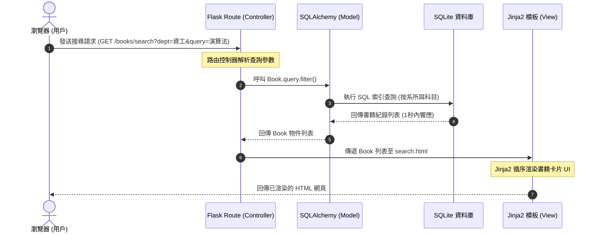
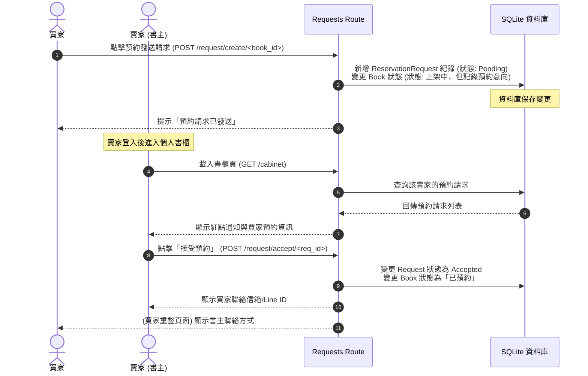

# 系統架構設計文件 (System Architecture) - 校園二手書交換平台

本文件詳述「校園二手書交換平台」的系統架構、元件關係、目錄結構與關鍵設計決策，供開發團隊做為實作指南。

---

## 1. 技術架構說明

### 1.1 選用技術與原因

本平台秉持**輕量級、易於開發測試、高內聚力**的原則，採用以下技術選型：

| 技術元件 | 選用技術 | 選用原因與優勢 |
| :--- | :--- | :--- |
| **後端核心** | **Python + Flask** | Flask 是輕量級微框架，無強制性結構，極具彈性，非常適合快速構建 MVP。 |
| **網頁渲染** | **Jinja2 模板引擎** | 與 Flask 原生無縫整合，支援模板繼承與條件渲染。不需前後端分離，簡化部署與開發流程。 |
| **資料庫** | **SQLite** | 採用單一檔案型關聯式資料庫，無需安裝與維護獨立伺服器，對開發與輕量校園應用已綽綽有餘。 |
| **資料庫 ORM** | **SQLAlchemy** | 提供物件關聯對映 (ORM)，能以 Python 物件操作資料庫，全面防範 SQL 注入 (SQL Injection) 攻擊。 |
| **前端設計** | **Vanilla HTML / CSS / JS** | 配合專案要求，不使用 React/Vue 等重型框架。使用純 CSS 設計高質感**簡潔卡片式**、**RWD 響應式**介面。 |

---

### 1.2 Flask MVC 模式說明

雖然 Flask 預設沒有強制的目錄結構，但為確保程式碼的高可讀性與維護性，本專案將採用**經典的 MVC (Model-View-Controller) 架構**：

*   **Model (模型)**：由 `app/models/` 負責。
    *   定義資料庫 Schema（如使用者、書籍、請求、留言等）。
    *   負責與 SQLite 進行資料交互（透過 SQLAlchemy ORM）。
*   **View (視圖)**：由 `app/templates/`（Jinja2 模板）及 `app/static/`（靜態資源）負責。
    *   負責將資料渲染成 HTML 呈現給瀏覽器。
    *   採用 Vanilla CSS 進行版面編排與響應式適配，實現極簡卡片式 UI。
*   **Controller (控制器)**：由 `app/routes/` 負責（使用 Flask Blueprints 藍圖功能）。
    *   接收瀏覽器發送的 HTTP 請求，處理商業邏輯。
    *   呼叫 Model 讀寫資料，並選擇對應的 View (Jinja2) 渲染後回傳給使用者。

```
                   ┌────────────────────────┐
                   │    瀏覽器 (Browser)    │
                   └───────────┬────────────┘
                         ▲     │ HTTP 請求
               HTML 渲染 │     ▼
                   ┌─────┴──────────────────┐
                   │  Controller (Routes)   │
                   └─────┬────────────┬─────┘
                         │            │
             讀寫資料ORM │            │ 載入與填充資料
                         ▼            ▼
                   ┌──────────┐  ┌──────────┐
                   │  Model   │  │   View   │
                   │ (models) │  │(template)│
                   └────┬─────┘  └──────────┘
                        │
                        ▼
                   ┌──────────┐
                   │  SQLite  │
                   └──────────┘
```

---

## 2. 專案資料夾結構

本專案採用 Flask Blueprint（藍圖）進行模組化規劃，以應對未來的擴充需求。

```text
Final-Exam/
├── app/
│   ├── __init__.py          # 應用程式工廠 (Application Factory)，初始化 Flask 與 Extensions
│   ├── models/              # Model 層：資料庫模型
│   │   ├── __init__.py
│   │   ├── user.py          # 使用者帳號模型（信箱註冊、密碼雜湊）
│   │   ├── book.py          # 書籍模型（上架資訊、書況、價格/交換、狀態）
│   │   ├── request.py       # 預約/交換請求模型（買賣雙方媒合）
│   │   └── comment.py       # 書籍詳情留言模型（留言板問答）
│   │
│   ├── routes/              # Controller 層：路由控制 (Flask Blueprints)
│   │   ├── __init__.py
│   │   ├── auth.py          # 登入、註冊與學校網域信箱驗證邏輯
│   │   ├── books.py         # 書籍上架、分類檢索、搜尋、書籍詳情
│   │   ├── cabinet.py       # 個人書櫃管理（上架中/已預約/已成交狀態管理）
│   │   └── requests.py      # 處理買家的預約請求、書主的接受與拒絕
│   │
│   ├── static/              # View 靜態資源
│   │   ├── css/
│   │   │   └── style.css    # 核心設計系統：現代 HSL 顏色、卡片布局、RWD、微互動
│   │   └── js/
│   │       └── main.js      # 前端基本互動（即時圖片預覽、表單驗證、非同步留言）
│   │
│   └── templates/           # View HTML 模板 (Jinja2)
│       ├── base.html        # 全域基礎布局（導覽列、頁尾、訊息提示通知區）
│       ├── index.html       # 平台首頁（最新上架、熱門書籍卡片）
│       ├── auth/
│       │   ├── login.html   # 登入頁面
│       │   ├── register.html# 註冊頁面（限 *.edu.tw 信箱）
│       │   └── verify.html  # 信箱驗證碼輸入頁面
│       ├── books/
│       │   ├── upload.html  # 書籍上架表單（含照片、書況勾選）
│       │   ├── search.html  # 檢索與篩選頁（系所、ISBN、科目）
│       │   └── detail.html  # 書籍詳情與留言問答板
│       └── cabinet/
│           ├── index.html   # 個人書櫃（狀態分頁卡片式管理）
│           └── edit.html    # 書籍資訊修改表單
│
├── docs/                    # 專案文件目錄
│   ├── PRD.md               # 產品需求文件
│   └── ARCHITECTURE.md      # 本系統架構文件
│
├── instance/                # 執行實例目錄（Git 忽略除 placeholder 外內容）
│   └── database.db          # SQLite 實體資料庫檔案
│
├── requirements.txt         # 專案套件依賴清單 (Flask, Flask-SQLAlchemy, etc.)
└── app.py                   # 專案啟動入口點
```

---

## 3. 元件關係與資料流向圖

以下使用 **Mermaid** 語法繪製系統三大核心流程的元件互動圖：

### 3.1 核心資料流向圖 (搜尋與檢索流程)

展示使用者進行「書籍搜尋與篩選 (F-02)」時，資料如何在各元件間流轉，保證 **1 秒內** 完成搜尋的優化路徑：



### 3.2 預約請求與狀態流轉流程 (F-03)

展示買家發送預約，系統狀態機變更，並通知賣家的資料流：



---

## 4. 關鍵設計決策

為了確保專案順利推展，並在有限的學期專案時間內達到最優效果，團隊做出了以下 4 個關鍵設計決策：

### 決策 1：採用應用程式工廠模式 (Application Factory Pattern)
*   **決策說明**：在 `app/__init__.py` 中定義 `create_app()` 函數來初始化 Flask，而不是直接在單一全域檔案中建立 `app` 實例。
*   **原因**：
    *   **避免循環導入 (Circular Imports)**：在開發複雜 MVC 時，Model、Route 與 App 之間極易發生循環引用。工廠模式能有效避免此問題。
    *   **便於測試與擴充**：能輕鬆建立多個不同配置的應用程式實例（如測試配置、開發配置）。

### 決策 2：限制學校網域信箱註冊 (`edu.tw`) 與「開發模擬驗證」機制
*   **決策說明**：
    1. 註冊表單輸入 email 時，後端透過正規表示式限制後綴必須以 `.edu.tw` 結尾。
    2. **模擬驗證機制**：為避免在開發環境因防火牆或 SMTP 設定造成寄信失敗，系統在開發模式下**不會真正寄信**，而是將「驗證碼」直接輸出在後端 Terminal 終端機日誌 (Log) 中。
*   **原因**：
    *   **安全性與封閉性**：符合 PRD 中「限學校網域信箱認證註冊」的要求，防範外部惡意使用者。
    *   **零外部依賴**：在沒有正式郵件伺服器的情況下，學生只需查看後端日誌即可拿到驗證碼完成註冊流程，極大簡化了展示與評分難度。

### 決策 3：一對多關聯的留言板（Threaded Comment Board）
*   **決策說明**：在 `Comment` 模型中，除了記錄 `book_id` 外，特別設計了一個 `parent_id` 欄位指向 `Comment.id` 本身，形成自我參考的一對多關聯。
*   **原因**：
    *   能完美實作**「問題與回覆」**的兩層式結構（買家發問 -> 書主針對該發問直接進行 Threaded 回覆），畫面呈現清晰。
    *   利用資料庫關聯，當書籍下架或刪除時，可透過 `cascade="all, delete-orphan"` 聯級刪除所有相關留言，防範資料孤兒。

### 決策 4：無金流面交狀態機 (Transaction State Machine)
*   **決策說明**：將書籍交易流程定義為嚴格的**狀態機 (State Machine)**：`Available (上架中)` -> `Reserved (已預約/面交中)` -> `Sold (已成交/歸檔)`。狀態變更只能由特定操作觸發：
    *   買家送出預約 $\rightarrow$ 狀態保留/待審核。
    *   賣家按下接受 $\rightarrow$ 書籍變更為 `Reserved`。
    *   面交完成後由賣家點擊「確認成交」 $\rightarrow$ 書籍變更為 `Sold`。
*   **原因**：
    *   由於**不包含線上金流**，平台必須依賴合理的狀態流轉來維護書籍的生命週期。
    *   限制其他買家對 `Reserved` 或 `Sold` 的書籍重複發送請求，保證交易秩序。
