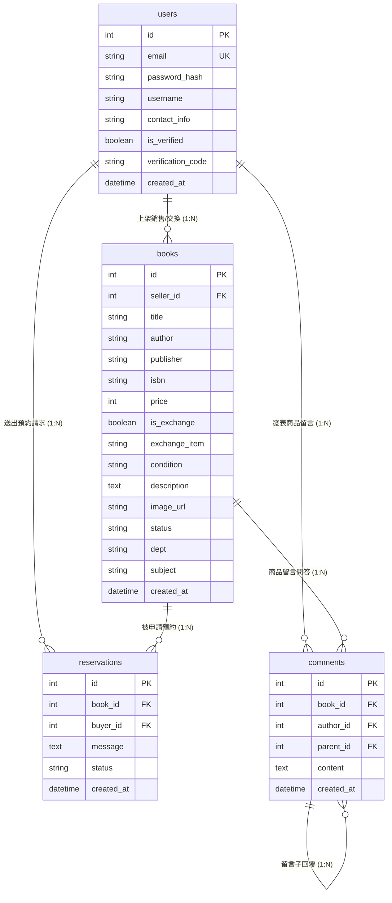

# 資料庫設計與 Python Model 規劃 (Database Design & SQLAlchemy Models)

本文件規劃「校園二手書交換平台」的 SQLite 資料表結構、欄位定義、關聯性（ER 圖）以及對應的 Python SQLAlchemy ORM Model 實作。

---

## 1. 實體關係圖 (ER Diagram)

以下使用 Mermaid 語法繪製完整的資料庫 ER 圖，展示四個核心資料表 `users`、`books`、`reservations` 與 `comments` 的關聯結構：



---

## 2. 資料表詳細說明

### 2.1 會員資料表 (`users`)
*   **用途**：管理校園師生帳號、驗證狀態及聯絡資訊。
*   **特性**：`email` 具備唯一性，且於邏輯層限制註冊後綴必須為 `*.edu.tw`。

| 欄位名稱 (Column) | 資料型別 (Type) | 鍵值 (Key) | 必填 (Null) | 預設值 (Default) | 說明 (Description) |
| :--- | :--- | :--- | :--- | :--- | :--- |
| `id` | INTEGER | PK | NOT NULL | 自增 | 使用者唯一的流水號編號 |
| `email` | VARCHAR(120)| UNIQUE | NOT NULL | - | 註冊信箱（格式必須為學校 `.edu.tw` 網域） |
| `password_hash` | VARCHAR(128)| - | NOT NULL | - | 加密存放的密碼雜湊值（使用 Werkzeug pbkdf2）|
| `username` | VARCHAR(80) | - | NOT NULL | - | 使用者暱稱/真實姓名 |
| `contact_info` | VARCHAR(255)| - | NULL | - | 面交用聯絡資訊（例如 Line ID、手機） |
| `is_verified` | BOOLEAN | - | NOT NULL | `False` (0) | 是否已通過信箱驗證碼驗證 |
| `verification_code`| VARCHAR(6) | - | NULL | - | 目前的信箱驗證碼（6 碼英數或數字） |
| `created_at` | DATETIME | - | NOT NULL | 當前時間 | 註冊時間戳記 |

### 2.2 二手書籍資料表 (`books`)
*   **用途**：存放二手書商品資訊，支援多樣化篩選（系所、科目、ISBN）。
*   **狀態流轉**：`status` 支援 `Available`（上架中）、`Reserved`（已預約面交中）、`Sold`（已成交）。

| 欄位名稱 (Column) | 資料型別 (Type) | 鍵值 (Key) | 必填 (Null) | 預設值 (Default) | 說明 (Description) |
| :--- | :--- | :--- | :--- | :--- | :--- |
| `id` | INTEGER | PK | NOT NULL | 自增 | 書籍唯一流水號 |
| `seller_id` | INTEGER | FK | NOT NULL | - | 關聯 `users.id`，代表此書的擁有者/賣家 |
| `title` | VARCHAR(255)| - | NOT NULL | - | 書籍名稱（教科書名） |
| `author` | VARCHAR(255)| - | NOT NULL | - | 書籍作者 |
| `publisher` | VARCHAR(255)| - | NULL | - | 出版社 |
| `isbn` | VARCHAR(13) | - | NULL | - | ISBN 國際標準書號（10 碼或 13 碼） |
| `price` | INTEGER | - | NOT NULL | 0 | 二手售價（若設定為交換，則通常為 0） |
| `is_exchange` | BOOLEAN | - | NOT NULL | `False` (0) | 是否接受「書籍交換」 |
| `exchange_item` | VARCHAR(255)| - | NULL | - | 期望交換的書籍或類型說明 |
| `condition` | VARCHAR(50) | - | NOT NULL | '輕微劃記' | 書況評級（全新/接近全新/輕微劃記/劃記繁多/書頁破損） |
| `description` | TEXT | - | NULL | - | 其他補充說明（如折角、筆記多寡等） |
| `image_url` | VARCHAR(255)| - | NULL | - | 上傳的實體書籍封面相片存放路徑 |
| `status` | VARCHAR(20) | - | NOT NULL | 'Available' | 交易狀態：`Available` / `Reserved` / `Sold` |
| `dept` | VARCHAR(100)| - | NULL | - | 適用系所（例如：資工系、企管系） |
| `subject` | VARCHAR(100)| - | NULL | - | 適用科目名稱（例如：演算法、計算機概論） |
| `created_at` | DATETIME | - | NOT NULL | 當前時間 | 書籍上架時間戳記 |

### 2.3 預約請求資料表 (`reservations`)
*   **用途**：紀錄買家對特定書籍發送的購買或交換申請。

| 欄位名稱 (Column) | 資料型別 (Type) | 鍵值 (Key) | 必填 (Null) | 預設值 (Default) | 說明 (Description) |
| :--- | :--- | :--- | :--- | :--- | :--- |
| `id` | INTEGER | PK | NOT NULL | 自增 | 預約單唯一流水號 |
| `book_id` | INTEGER | FK | NOT NULL | - | 關聯 `books.id`，申請哪一本書 |
| `buyer_id` | INTEGER | FK | NOT NULL | - | 關聯 `users.id`，發起預約的買家 |
| `message` | TEXT | - | NULL | - | 買家附帶的面交備註說明或交換方案建議 |
| `status` | VARCHAR(20) | - | NOT NULL | 'Pending' | 處理進度：`Pending`（審核中）/ `Accepted`（接受）/ `Rejected`（拒絕） |
| `created_at` | DATETIME | - | NOT NULL | 當前時間 | 預約申請發送時間 |

### 2.4 商品留言資料表 (`comments`)
*   **用途**：書籍詳情頁下方的留言問答區。
*   **自關聯**：`parent_id` 欄位設計，用於建立買家公開提問、書主對應回覆的兩層式 Threaded 關係。

| 欄位名稱 (Column) | 資料型別 (Type) | 鍵值 (Key) | 必填 (Null) | 預設值 (Default) | 說明 (Description) |
| :--- | :--- | :--- | :--- | :--- | :--- |
| `id` | INTEGER | PK | NOT NULL | 自增 | 留言流水號 ID |
| `book_id` | INTEGER | FK | NOT NULL | - | 關聯 `books.id`，在該書下方的留言問答 |
| `author_id` | INTEGER | FK | NOT NULL | - | 關聯 `users.id`，留言者是誰 |
| `parent_id` | INTEGER | FK | NULL | - | 自關聯 `comments.id`，代表是回覆哪一則留言。若為 NULL 則為第一層提問。 |
| `content` | TEXT | - | NOT NULL | - | 留言/發問內容 |
| `created_at` | DATETIME | - | NOT NULL | 當前時間 | 留言發表時間 |

---

## 3. SQL 建表語法 (DDL)

完整可用於 SQLite 初始化資料庫之 SQL Script 已存放在 [database/schema.sql](file:///c:/Users/Administrator/Final-Exam/database/schema.sql)。包含適當的外鍵聯級刪除 (`ON DELETE CASCADE`)，確保在刪除使用者或書籍時，對應的歷史紀錄留言能自動清空，維護資料一致性。

---

## 4. Python Model 實作 (SQLAlchemy ORM)

資料庫模組檔案皆已成功建立於 `app/models/` 目錄中，並封裝了完整的資料存取功能（CRUD 方法：`create`, `get_all`, `get_by_id`, `update`, `delete`）。

### 4.1 初始化宣告 `app/models/__init__.py`
[__init__.py](file:///c:/Users/Administrator/Final-Exam/app/models/__init__.py) 建立並暴露了 `db` 實例，作為所有模型宣告的根基，確保專案無循環導入之虞：
```python
from flask_sqlalchemy import SQLAlchemy

db = SQLAlchemy()

from app.models.user import User
from app.models.book import Book
from app.models.reservation import Reservation
from app.models.comment import Comment
```

### 4.2 會員模型 `app/models/user.py`
[user.py](file:///c:/Users/Administrator/Final-Exam/app/models/user.py) 實作了使用者的管理，封裝了密碼雜湊雜湊演算法與一對多刪除聯級。

### 4.3 書籍模型 `app/models/book.py`
[book.py](file:///c:/Users/Administrator/Final-Exam/app/models/book.py) 實作了二手書的管理，支援各種檢索篩選欄位（ISBN, dept, subject, seller）與 CRUD。

### 4.4 預約模型 `app/models/reservation.py`
[reservation.py](file:///c:/Users/Administrator/Final-Exam/app/models/reservation.py) 管理預約請求的生命週期狀態 (`Pending` -> `Accepted`/`Rejected`)，並連繫買家與賣家。

### 4.5 留言模型 `app/models/comment.py`
[comment.py](file:///c:/Users/Administrator/Final-Exam/app/models/comment.py) 實作問答板的核心，透過自參考（Self-Referential）提供對話層級式呈現與聯級刪除。
