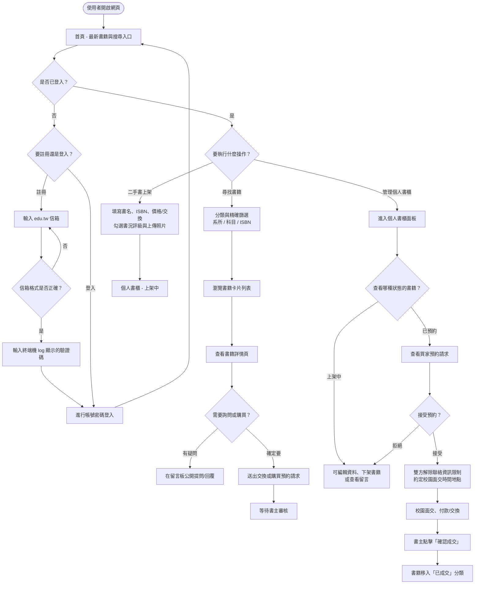
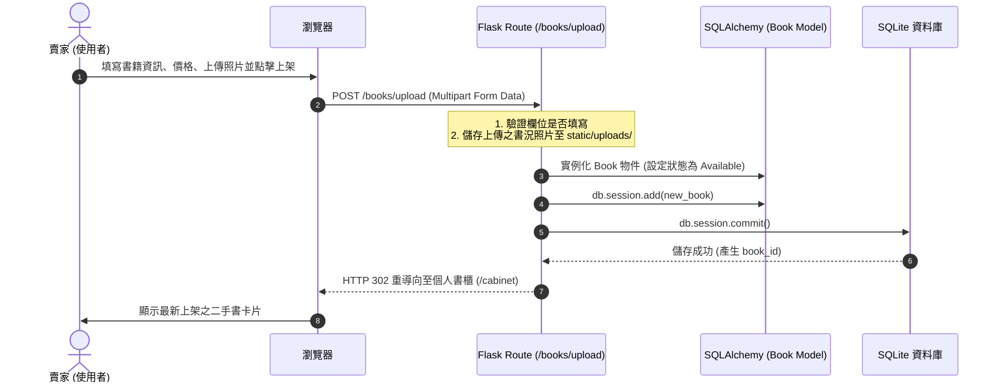
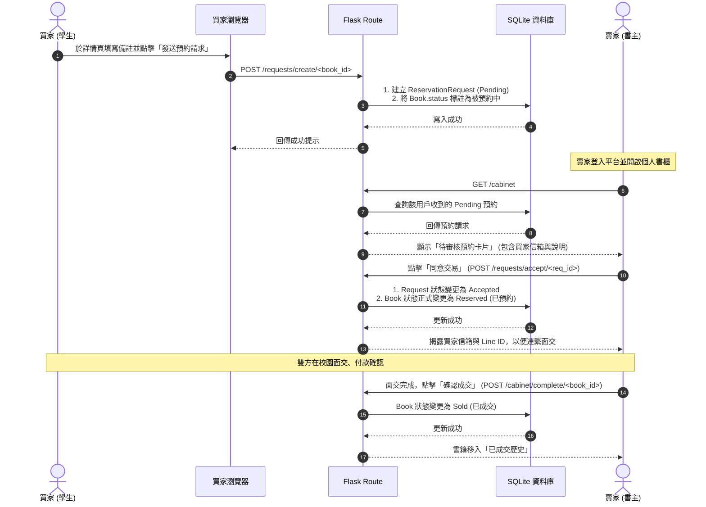

# 使用者流程圖與系統序列圖 (Flowcharts & Sequence Diagrams)

本文件描述「校園二手書交換平台」的使用者操作流程（User Flow）、系統資料互動序列圖（Sequence Diagram）以及對應的功能與路由對照表。

---

## 1. 使用者流程圖 (User Flow)

此圖描述使用者從進入網站開始，如何登入、搜尋書籍、進行上架、留言詢問，直至最後完成預約面交的操作路徑：

---

## 2. 系統序列圖 (Sequence Diagrams)

### 2.1 書籍上架資料流 (F-01)

描述使用者填寫書籍表單並送出時，後端控制器、資料庫與頁面重導向的互動順序：

### 2.2 預約請求與媒合流程 (F-03)

描述買家發送請求到雙方聯絡資訊揭露、面交完成的完整資料互動流：

---

## 3. 功能路由對照表

本表列出「校園二手書交換平台」的所有 Flask 路由、HTTP 方法、對應的 Jinja2 模板，以及實作的功能定義：

| 功能代號 | 功能模組 | HTTP 方法 | URL 路徑 | 對應 Jinja2 模板 | 邏輯處理與說明 |
| :--- | :--- | :--- | :--- | :--- | :--- |
| **全域** | 首頁展示 | `GET` | `/` | `index.html` | 展示最新上架的書籍卡片，提供快捷搜尋欄。 |
| **會員** | 註冊頁面 | `GET` | `/auth/register` | `auth/register.html` | 呈現註冊表單。 |
| **會員** | 執行註冊 | `POST` | `/auth/register` | *(無，重新導向)* | 檢核 `.edu.tw` 信箱並寫入用戶，於 Terminal 輸出驗證碼。 |
| **會員** | 驗證頁面 | `GET` | `/auth/verify` | `auth/verify.html` | 呈現輸入驗證碼的畫面。 |
| **會員** | 執行驗證 | `POST` | `/auth/verify` | *(無，重新導向)* | 比對驗證碼，成功則啟用帳號並導向登入。 |
| **會員** | 登入頁面 | `GET` | `/auth/login` | `auth/login.html` | 呈現登入表單。 |
| **會員** | 執行登入 | `POST` | `/auth/login` | *(無，重新導向)* | 驗證密碼 Hash，成功後寫入 Session。 |
| **會員** | 登出帳號 | `GET` | `/auth/logout` | *(無，重新導向)* | 清除 Session，導向首頁。 |
| **F-01** | 書籍上架頁 | `GET` | `/books/upload` | `books/upload.html` | 限制已登入用戶，呈現上架填寫表單。 |
| **F-01** | 執行上架 | `POST` | `/books/upload` | *(無，重新導向)* | 處理相片上傳、寫入書籍 Model，導向個人書櫃。 |
| **F-02** | 分類與檢索 | `GET` | `/books/search` | `books/search.html` | 支援系所選單、科目、ISBN 之組合篩選，回傳卡片。 |
| **F-05** | 書籍詳情頁 | `GET` | `/books/<int:id>` | `books/detail.html` | 展示完整書況、留言問答板、預約按鈕。 |
| **F-05** | 公開留言/回覆 | `POST` | `/books/<int:id>/comment`| *(無，重新導向)* | 寫入問答（支援 `parent_id` 兩層式子留言回覆）。 |
| **F-03** | 建立預約請求 | `POST` | `/requests/create/<int:book_id>`| *(無，重新導向)* | 買家送出購買/交換意願書，標註書籍保留狀態。 |
| **F-04** | 個人書櫃頁 | `GET` | `/cabinet` | `cabinet/index.html` | 依「上架中/已預約/已成交」分頁卡片管理。 |
| **F-04** | 編輯書籍頁 | `GET` | `/cabinet/edit/<int:book_id>` | `cabinet/edit.html` | 限制書主，呈現修改表單。 |
| **F-04** | 執行修改 | `POST` | `/cabinet/edit/<int:book_id>` | *(無，重新導向)* | 更新書籍資訊，導回書櫃。 |
| **F-04** | 刪除/下架書籍 | `POST` | `/cabinet/delete/<int:book_id>`| *(無，重新導向)* | 書主一鍵刪除未交易之書籍。 |
| **F-03** | 接受預約 | `POST` | `/requests/accept/<int:req_id>`| *(無，重新導向)* | 書主接受預約，書籍變更為 Reserved，揭露聯繫方式。 |
| **F-03** | 拒絕預約 | `POST` | `/requests/reject/<int:req_id>`| *(無，重新導向)* | 書主拒絕預約，書籍狀態還原為 Available。 |
| **F-04** | 確認成交完成 | `POST` | `/cabinet/complete/<int:book_id>`| *(無，重新導向)* | 交易完成，狀態改為 Sold，正式關閉該次交易流程。 |
